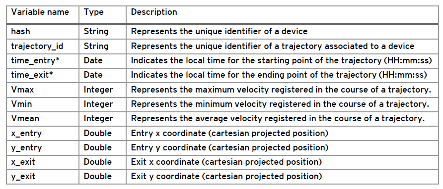
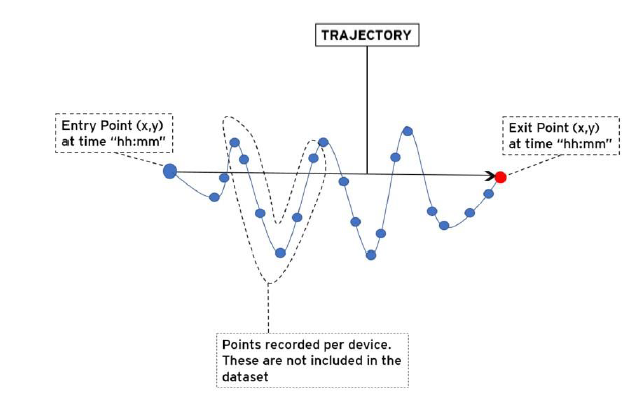
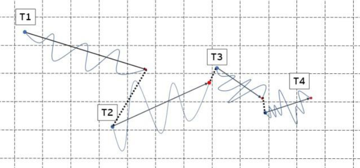
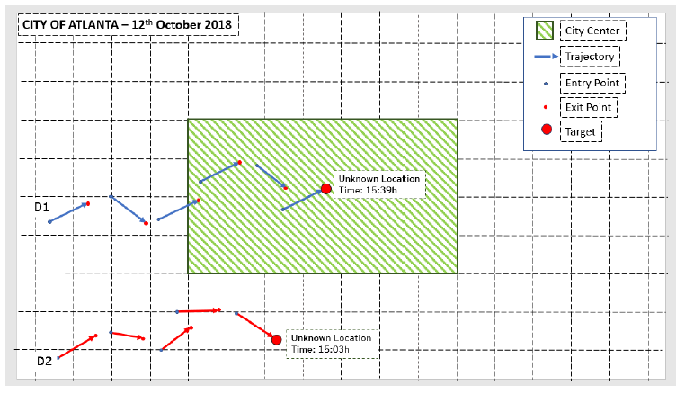
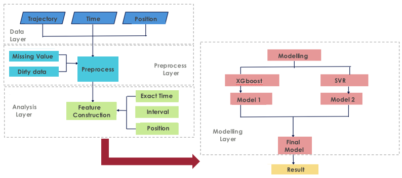
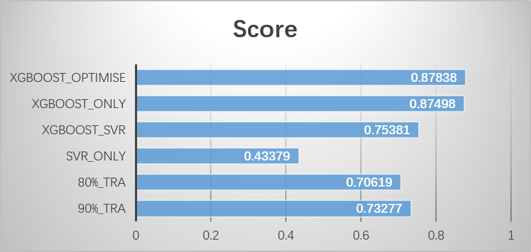

**[EY NextWave Data Science competition 2019](https://www.ey.com/gl/en/careers/students/ey-data-science-challenge)** focuses on how data can help the next smart city thrive, and boost the mobility of the future.  In this competition, systematic data mining and processing ideas are used here. I am glad to share them.

### 1.Understand the problem

#### 1.1 Dataset Description

The dataset contains the anonymized geolocation data of multiple mobile devices in the City of Atlanta (US) for 11 working days in October 2018. There are approximately 210,000 devices and 11 columns in the dataset. The variables in the dataset are as follows:

Every device ID resets every 24 hours. Therefore, we will not be able to trace the same device across different days.

#### 1.2 Task and goal

Our task is to produce a model that helps authorities to understand the journeys of citizens while they move in the city throughout the day. 

Each journey is formed by several trajectories. A trajectory is defined as the route of a moving
person in a straight line with an entry and an exit point. Below is an example of one trajectory
from one of the devices:

For each device, you will get multiple trajectories, like this:

We are expected to predict the location of this last exit point and whether this device is within
the city center or not. The target variable is the latter. Here is a graphic example.

After we estimate the position of each target, we need to classify that point based on
whether it is located inside the city center or not. The limits of the city center of Atlanta are 3750901.5068 ≤ 𝑥 ≤ 3770901.5068, −19268905.6133 ≤ 𝑦 ≤ −19208905.6133. 

Then we will need to classify each of the exit points whether they are within (1) or outside (0) the
limits of the city center. Some trajectories may “cross” the city center, but their exit point will be outside the city center. These cases can be considered outside the center.

Our results are required in the following format: trajectory_id; city_center. Finally, we find this task is a typical classification case in supervised learning. So, our goal is to train some models to classify these devices.

### 2.Methodology

Our method follows the systematic data mining structure. As we can see here, there are 4 layers. The data layer contains the source data. 

And we did the process data in Preprocess Layer. Then we extract some new features and construct the model.

#### 2.1 Data Preprocess

Generally, data preprocess includes data cleaning, data integration, data reduction, and data transformation. **Here are some specifications:** ***[one](https://medium.com/datadriveninvestor/data-preprocessing-for-machine-learning-188e9eef1d2c)***, ***[two](https://zhuanlan.zhihu.com/p/51131210)***, ***[three](https://en.wikipedia.org/wiki/Data_pre-processing)***.

Specifically, at Preprocess Layer, we compute the missing value of each column in source data and we find there are too many missing values in the three velocity columns, over 60% here. But, without these, the model performance is also good so we just delete them.

#### 2.2 Modelling

At the analysis layer, we find that there is **a magic relation** between the exact Time and position, that is when the entry time and exit time of one car are the same, the xy exit values are equal to the xy entry position. And we use this finding to add missing values of xy entry position. And the added part weights around 40%.

We separate the dataset as 90% training dataset and 10% testing dataset. To compare with former separation, we also separate the dataset as 80% training dataset and 20% testing dataset and use them to train a C4.5 decision tree model. We find that former separation performs better than the latter.

Then we use XGBoost, SVR, and XGboost_Optimiser as the model. Accuracy, precision, recall, F-1, and MCC are the evaluation offline. Here are some [***experience*** ](https://dingby.site/2018/03/07/%E6%9C%BA%E5%99%A8%E5%AD%A6%E4%B9%A0%E6%80%A7%E8%83%BD%E8%AF%84%E4%BC%B0%E6%8C%87%E6%A0%87/)and ***[insights](https://www.pluralsight.com/guides/evaluating-a-data-mining-model)*** on how to chose evaluations in machine learning tasks.

Submissions are evaluated using the F1-score. We may see the results below. The higher score, the better result.

### 3.Prospect

In the future, we may consider finding more hidden but efficient features, trying more advanced and proper models (Neural Network, AdaBoostClassifier...) to achieve better performance. 

Hopefully, our work could inspire solutions that help city authorities anticipate disruptions, make real-time decisions, design new services, and reshape infrastructures in order that cities as smart as their citizens.

### PS:

Today is a big data era. Data is just like an iceberg, what we can see is just a small piece, however, there is pretty large valuable information behind them.

Thanks for [**EY** ](https://www.ey.com/en_cn)holding this meaningful competition of data mining. I am really enjoying it and hope more people join in kinda competitions to find the power of data, and big-data.

